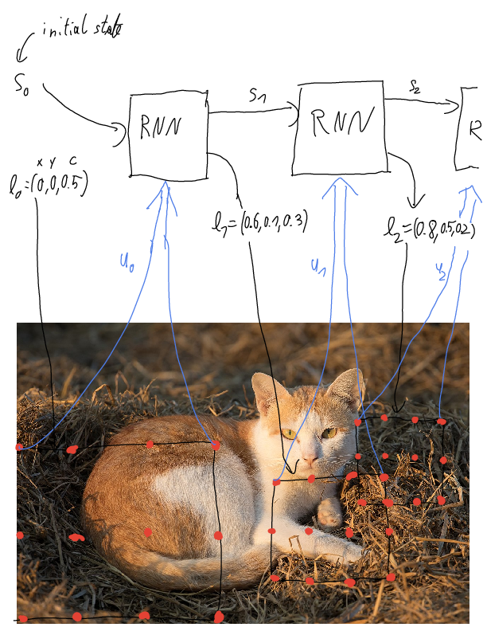

# Using function as network input
## High level idea
When humans want to extract a piece of information from an image they normally do not process it in a single run like neural networks. Instead they first get a quick overview, find a promising region, have a closer look at that region, then maybe again take a look at the higher level context of the detail they just saw, find another intersting region and continue like this until they found the information they need.

Here I propose a way to mimic this behavior for neural networks.
The input data is modeled as a continous function $f$. For instance in case of an image $i$ the function $f_i$ maps a coordinate $(x,y)$ to a tuple of color values in $i$ by interpolating the raw image. Here $x$ and $y$ can be in the range $(0,1)$.

The neural network will now act similar to a Recurrent Neural Network. In the first stage, a recurrent block is linked with itself many times. The Recurrent block gets as input the last state $s_j$ and a section of the image $u$. Its output is the next state $s_{j+1}$ and the desired location for the next image part $l$ it wants to look at. $l=(x,y,c)$ is a tuple of a (continous) coordinate $(x,y)$ and a scale $c$. $u$ is the pointwise evaluation of $f$ in a grid (with a fixed number of points) that is positioned according to the image section described by $l$.

The second stage will be a neural network that maps the last state $s_n$ to some output, for instance a classification, just like in regular RNNs.

So in conclusion the neural network will repeatedly look at different parts of the image, accumulating some (hopefully informative) state, always deciding at which part of the image to look next, and finally processes the state to an output.

Since $f_i$ is differentiable the network can be trained via backpropagation.


## Pseudocode for processing an image
```py
# x,y in (0,1), i has shape L x B x C
# Do a linear interpolation of an image
def f(i:Image,x,y:float):
    let (w,h) = i.shape
    let lower_indices = floor((x*w,y*h))
    let upper_indices = lower_indices+1
    let proportions = x*w-lower_indices[0],y*h-lower_indices[1]
    return (1-proportions)*i[lower_indices] + proportions*i[upper_indices]

class RecurrentCell:
    def init(self,preprocessor:NeuralNetwork, lstm_units:int):
        self.preprocessor=preprocessor
        self.lstm=LSTMCell(preprocessor.out_shape,lstm_units)
        self.params=(n.params,self.lstm.params)
    

    def forward(self,x):
        let ((h0,c0),u)=x
        let (lstm_input,next_location)=self.n.forward(u)
        let (h1,c1)=self.lstm.forward(lstm_input,h0,c0)
        return (next_location,(h1,c1))


class ContinousSpaceRNN:
    def init(self,preprocessor:NeuralNetwork,output_nn:NeuralNetwork, num_iterations:int, lstm_units=20, image_section_shape=(12,10)):
        self.recurrent_cell=RecurrentCell(preprocessor,lstm_units)
        self.output_nn=output_nn
        self.num_iterations=num_iterations
        self.lstm_units=lstm_units
        self.image_section_shape=image_section_shape
        self.params=(self.recurrent_cell.params, output_nn.params)


    def forward(self,i:Image):
        # start x=0,y=0,scale=1 <=> full picture
        let location=(0,0,1)
        let (section_width,section_height)=self.image_section_shape
        # use lstm library from somewhere
        let s=LSTM.initial_state(self.lstm_units)
        for _ in range(self.num_iterations):
            let (x,y,scale)=location
            # evaluate f pointwise in a grid
            let u = f.(i,range(x, x+scale, step=1/section_width), range(y,y+scale,step=1/section_height))
            (location,s)=self.recurrent_cell.forward((s,u))
        return self.output_nn.forward(s)

let NUM_CLASSES=10
let SECTION_WIDTH=12
let SECTION_HEIGHT=10
let LSTM_SIZE=20

# Use a small CNN to preprocess each image section
let preprocessor=Sequential(
    Convolution2d(size=5,in_channels=3,out_channels=5),
    ReLU(),
    Convolution2d(size=5,in_channels=5,out_channels=10),
    Flatten(),
    Linear(input_size=(SECTION_WITH-4)*(SECTION_HEIGHT-4)*10,output_size=LSTM_SIZE),
)
# A small classifier
let output_nn=Sequential(
    Linear(input_size=10,output_size=NUM_CLASSES),
    Softmax(),
)
let rnn=ContinousSpaceRNN(preprocessor,output_nn,num_iterations=10,lstm_units=LSTM_SIZE,image_section_shape=(SECTION_WIDTH,SECTION_HEIGHT))
# shape: 1920x1080x3
let image=array(load_image("data/cat.jpg"))
# shape: 1xNUM_CLASSES
let prediction=rnn.forward([image])
```

## Possible benefits and challenges

- In the best case this solution will provide a less resource-intensive alternative to attention mechanisms since the network pays attention to a small part of the image without needing to evaluate the rest of the image.
- Invariance to different image resolutions
- Might solve the problem of long dependencies since the network can just have another look at a part of the image if it "forgot" something
- Will the image section selection mechanism be trainable via gradient descent?
- Will it be possible to interpolate the image efficiently (maybe even without loading the whole image into memory)?
